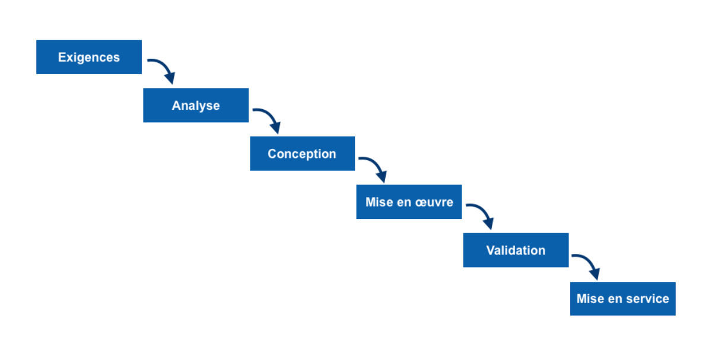
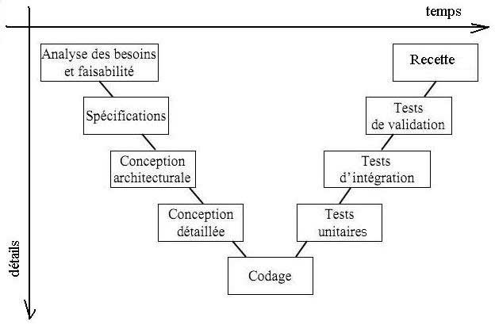

# Séance 0 – Ingénierie logicielle
## POO avancée, principes SOLID, Clean Code

Enseignant : Jean Delpech

Cours : Data Science

Classe : M1 Data/IA et Data/E

Année scolaire : 2025/2026

Dernière mise à jour : mai 2026

---

## Objectifs 

- Rappel historique
- Identifier les défauts d'une architecture logicielle et les relier à des violations de principes connus
- Appliquer les cinq principes SOLID pour structurer du code data maintenable
- Choisir entre héritage et composition selon le contexte
- Produire du code Python lisible, documenté et testable (Clean Code)

> Ces principes sont un fil conducteur de tout le cours. Chaque fois qu'on implémente une structure de données ou un algorithme, on se demandera : est-ce que mon code respecte ces principes ?

---

## 1. Contexte historique

### Frise chronologique des modèles de conception en génie logiciel

#### Années 1950

Discipline nouvelle : on forge les termes qui permettait de décrire ce qu’il se passe.

« Software » proposé par Tukey en 1958 (co-créateur du FFT, test de Tukey -> test de comparaison de moyennes)

Une première proposition de découper le développement en phases (**Planification / Spécification / Codage**) a été formalisée par Benington en 1956) 

#### Années 1960–début 1970 : Premières structurations

- Apparition des premières méthodes d’ingénierie logicielle dans les grands projets (militaire, spatial).
- Margaret Hamilton (logiciels embarqués Apollo, Skylab) est la première à proposer de considérer le développement logiciel comme une ingénierie (terme réservé pour le hardware seulement auparavant). 
- Idée clé : **découper le développement en phases** (analyse, conception, implémentation).
- Pas encore de modèle formel → pratiques empiriques.

Contexte : crise du logiciel (“software crisis”) → projets en retard, bugs massifs.


Par Adam Cuerden – Cette image a été retouchée, ce qui signifie qu'elle a été modifiée par ordinateur et est différente de l'image d'origine. Liste des modifications : dust and scratches removed; curves tweaked to bring out shadows, approximately 3 pixels cropped from bottom in order to remove a border. See upload history of the PNG for version without colour tweaks. L'image d'origine se trouve ici : Margaret Hamilton.gif: ., Domaine public, https://commons.wikimedia.org/w/index.php?curid=59655977

------

#### 1970 : Modèle en cascade (Waterfall)

- Formalisé par Winston W. Royce

Principe :

- Enchaînement linéaire des phases :
  - exigences → conception → implémentation → tests → maintenance

Important :

- Royce lui-même critique cette rigidité… mais le modèle sera largement adopté sous forme simplifiée.



Par Cth027 – Travail personnel, CC BY-SA 4.0, https://commons.wikimedia.org/w/index.php?curid=79394662

------

#### Années 1980 : Modèle en V (V-model)

- Formalisation dans des standards industriels comme le V-Modell (German standard)

Innovation majeure :

- Mise en correspondance entre :
  - phases de conception (descente)
  - phases de test (remontée)

Apport :

- Introduction explicite de la **validation et vérification systématiques**

)

Par Original uploader was Christophe.moustier sur Wikipédia français – Christophe.moustier sur Wikipédia français, CC BY-SA 3.0, https://commons.wikimedia.org/w/index.php?curid=20697115

------

#### Fin 1980 – 1990 : Modèles itératifs et incrémentaux

- Réaction aux limites du waterfall

##### Exemples :

- Spiral Model (1986)
- Rational Unified Process (années 1990)

Idées clés :

- Développement **itératif**
- Gestion des **risques**
- Livraisons incrémentales

.svg)

Par Mdaumas – Travail personnel, CC BY-SA 3.0, https://commons.wikimedia.org/w/index.php?curid=18170045

------

#### 2001 : Révolution Agile

- Publication du Manifesto for Agile Software Development

Auteurs notables :

- Kent Beck
- Martin Fowler

Rupture majeure :

- Priorité à :
  - individus et interactions
  - logiciel fonctionnel
  - adaptation au changement

Méthodes associées :

- Scrum, XP, Kanban

------

#### Années 2000 : Bonnes pratiques de conception objet

##### SOLID

- Popularisés par Robert C. Martin

Principes :

- Single Responsibility
- Open/Closed
- Liskov Substitution
- Interface Segregation
- Dependency Inversion

Objectif :

- Améliorer la **maintenabilité** et la **modularité**

------

#### Années 2000–2010 : Industrialisation et qualité

- Intégration de pratiques comme :
  - tests automatisés
  - intégration continue
  - refactoring systématique

Concepts clés :

- TDD (Test Driven Development)
- Clean Code

------

#### Années 2010 : DevOps et livraison continue

- Fusion des équipes dev + ops

Objectifs :

- Déploiement continu
- Automatisation complète des pipelines

Résultat :

- Réduction du temps entre développement et mise en production

------

#### Années 2020 : Architectures modernes

- Microservices
- Cloud-native
- Event-driven

Tendance :

- Systèmes distribués, hautement scalables

------

### Lecture globale de l’évolution

On peut résumer la progression ainsi :

1. **Structurer** (années 60–70)
2. **Formaliser** (waterfall, V-model)
3. **Assouplir** (itératif, spiral)
4. **Adapter** (agile)
5. **Améliorer la conception interne** (SOLID)
6. **Industrialiser** (CI/CD, DevOps)
7. **Distribuer et scaler** (cloud, microservices)

### 1.1 La crise du logiciel

En 1968, l'OTAN organise la première conférence sur le génie logiciel à Garmisch, en Allemagne. Le constat est sévère : les projets logiciels dépassent systématiquement les budgets, les délais, et livrent des produits instables. On parle de **crise du logiciel**.

Les symptômes sont les mêmes qu'aujourd'hui dans de nombreuses équipes data :

- Du code que personne ne comprend plus après six mois
- Des modifications qui cassent des fonctionnalités non liées
- Des tests absents ou impossibles à écrire
- Une impossibilité à réutiliser ce qui existe

La réponse de la communauté a été de construire une discipline – le **génie logiciel** – avec des méthodes, des principes et des outils.

### 1.2 Du modèle en cascade au cycle en V à l'Agile

Pendant longtemps, le développement logiciel s’est structuré autour d’une vision **linéaire et séquentielle** héritée du modèle en cascade, formalisé dans les années 1970 par Winston W. Royce.

L’idée est simple :
 on avance étape par étape, sans retour en arrière :

> spécifier → concevoir → implémenter → tester → livrer

Ce modèle apporte de la rigueur et une forte structuration des projets.
 Mais il repose sur une hypothèse forte : **les besoins sont connus dès le départ et ne changent pas**.

En pratique, cette hypothèse est rarement vérifiée :

- les utilisateurs découvrent leurs besoins en cours de projet
- les contraintes évoluent
- les erreurs de conception sont détectées tardivement

------

#### Le cycle en V : structurer la validation

Pour répondre à ces limites, les années 1980 voient apparaître le **cycle en V**, notamment via des standards industriels comme le V-Modell (German standard).

Le principe reste séquentiel, mais avec une amélioration essentielle :

chaque phase de conception est associée à une phase de test**

- spécifications ↔ tests d’acceptation
- conception système ↔ tests système
- conception détaillée ↔ tests unitaires

Apport majeur :

- on **anticipe les tests dès la conception**
- on introduit une vraie logique de **validation / vérification**

Cependant, le modèle reste rigide :

- les retours en arrière sont coûteux
- l’adaptation aux changements reste difficile

------

#### La rupture Agile : accepter l’incertitude

En 2001, dix-sept praticiens publient le Manifesto for Agile Software Development, marquant une rupture profonde.

Plutôt que de vouloir tout prévoir, l’Agile part du principe que :

>  **le changement est inévitable – il faut l’intégrer, pas le combattre**

Le manifeste repose sur quatre valeurs fondamentales :

| On valorise davantage...            | ...que                       |
| ----------------------------------- | ---------------------------- |
| Les individus et leurs interactions | Les processus et les outils  |
| Un logiciel qui fonctionne          | Une documentation exhaustive |
| La collaboration avec le client     | La négociation contractuelle |
| L'adaptation au changement          | Le suivi d'un plan           |

------

#### Des modèles séquentiels aux modèles adaptatifs

Les méthodes issues de cette philosophie – **Scrum**, **XP (Extreme Programming)**, **Kanban** – transforment profondément la manière de travailler :

- on ne livre plus **à la fin**, mais **en continu**
- on ne conçoit plus tout à l’avance, mais **progressivement**
- on ne fige plus les besoins, on les **fait évoluer**

Voici une présentation plus détaillée : 

##### 1. La méthode Agile

La méthode Agile désigne un ensemble d’approches de gestion de projet qui privilégient l’adaptation, la collaboration et la livraison continue de valeur plutôt que la planification rigide. Formalisée en 2001 avec le Manifesto for Agile Software Development, elle repose sur l’idée que les besoins évoluent en permanence et ne peuvent pas être entièrement définis à l’avance. Le travail est donc organisé en **itérations courtes** (sprints), permettant de produire régulièrement des versions fonctionnelles du logiciel, d’obtenir du feedback et d’ajuster les priorités. L’Agile favorise ainsi une approche empirique : on apprend en construisant, en testant et en adaptant en continu.

##### 2. Scrum

**Scrum** est la méthode Agile la plus répandue. Elle structure le travail en **sprints** de durée fixe (souvent 1 à 4 semaines), au cours desquels une équipe pluridisciplinaire développe un incrément du produit. Le travail est piloté par un **Product Owner**, qui priorise les fonctionnalités dans un backlog, tandis que l’équipe s’organise de manière autonome pour atteindre les objectifs du sprint. Scrum repose sur des rituels clés (daily meeting, sprint planning, review, rétrospective) qui permettent de suivre l’avancement, de détecter les obstacles et d’améliorer en continu les pratiques. Cette méthode est particulièrement adaptée aux projets où les besoins évoluent rapidement.

##### 3. Extreme Programming (XP)

**Extreme Programming (XP)** met l’accent sur les **bonnes pratiques de développement** et la qualité du code. Elle introduit des techniques comme le **Test Driven Development (TDD)** (écrire les tests avant le code), le **pair programming** (programmation en binôme), ou encore l’**intégration continue**. L’objectif est de réduire les erreurs, d’améliorer la maintenabilité et de permettre des changements rapides sans dégrader le système. XP est particulièrement pertinente dans les environnements techniques exigeants, où la qualité du code et la capacité à évoluer rapidement sont critiques.

##### 4. Kanban

**Kanban** est une méthode Agile centrée sur la **visualisation du flux de travail** et l’amélioration continue. Les tâches sont représentées sur un tableau (physique ou numérique) avec des colonnes correspondant aux différentes étapes (à faire, en cours, terminé, etc.). Contrairement à Scrum, Kanban ne repose pas sur des itérations fixes, mais sur un flux continu de travail. Un principe clé est la **limitation du travail en cours (WIP)**, qui permet d’éviter la surcharge et d’optimiser la fluidité. Kanban est particulièrement adapté aux équipes qui gèrent des flux de tâches continus, comme la maintenance, le support ou les projets data.

------

#### En pratique pour un data scientist ou data engineer

Ce changement de paradigme est particulièrement visible dans les projets data :

- itérations courtes (sprints de 1 à 2 semaines) plutôt que projets longs et figés
- expérimentation progressive (modèles, features, pipelines)
- tests automatisés dès le début (data quality, modèles, pipelines)
- revues de code systématiques
- refactoring continu plutôt que réécriture complète

En résumé :

- **cascade / V-model** → chercher à maîtriser et planifier
- **Agile** → accepter l’incertitude et s’adapter rapidement

### 1.3 L'émergence des principes de conception

Parallèlement, des auteurs comme Robert C. Martin (« Uncle Bob »), Erich Gamma et al. (les *Gang of Four*) ont formalisé des principes de conception. Les principes **SOLID**, introduits par Robert C. Martin au début des années 2000, sont devenus la référence pour évaluer la qualité d'une architecture orientée objet.

Comme nous l’avons vu précédemment, au delà d’un modèle de gestion de projet, on se penche sur la conception interne lors du développement, ce qui nous amène à des principes de programmation objet avancée :

-  héritage vs. composition
- principes SOLID
-  principes du Clean Code : 
   -  nommage expressif 
   -  fonctions simples et courtes
   -  principes DRY, KISS (et autres acronymes)


---

## 2. POO avancée – Ce qui se passe quand l'héritage dévie

### 2.1 Rappel : les mécanismes de base

La POO repose sur quatre piliers :

- **Encapsulation** : cacher l'état interne, n'exposer que ce qui est nécessaire
- **Héritage** : une classe enfant hérite des attributs et méthodes de la classe parente
- **Polymorphisme** : des objets de types différents répondent à la même interface
- **Abstraction** : définir des contrats sans spécifier l'implémentation

Quelques précisions sur les deux derniers points :

* **Abstraction** : définir un contrat – ce qu'un objet *sait faire* – sans préciser *comment* il le fait. L'idée est de séparer l'interface (l’annonce / la promesse) de l'implémentation (le détail technique de comment c’est réalisé en vrai). Un bon exemple concret : dans un pipeline de données, on peut définir un composant `DataSource` qui expose une méthode `read()`. Le code qui utilise cette source n'a pas besoin de savoir si les données viennent d'un fichier CSV, d'une base PostgreSQL ou d'une API REST – il sait seulement que `read()` lui retournera un DataFrame. Chaque source concrète honore ce contrat à sa façon. C'est l'abstraction qui rend le code indépendant des détails techniques et donc plus facile à faire évoluer.

* **Polymorphisme** : la capacité pour des objets de types différents à répondre au même message (appel de méthode) de façon cohérente, chacun selon sa propre logique. Même exemple : si `CSVSource`, `PostgresSource` et `APISource` implémentent toutes les trois `read()`, le code du pipeline peut appeler `source.read()` sans se soucier du type concret de `source`. Selon l'objet passé, c'est la bonne implémentation qui s'exécute automatiquement. 

Ces mécanismes sont puissants, mais l'héritage en particulier est souvent **surutilisé**.

### 2.2 Les problèmes de l'héritage

L'héritage crée un **couplage fort** entre parent et enfant. Toute modification de la classe parente peut briser silencieusement les enfants. Plus la hiérarchie est profonde, plus ce risque s'amplifie, et ce d’autant plus avec des héritages multiples.

**Le problème du diamant** apparaît en héritage multiple : si `C` hérite de `A` et `B`, et que `A` et `B` héritent tous les deux de `D`, quelle version d'une méthode de `D` `C` doit-elle appeler ?

```
        D
       / \
      A   B
       \ /
        C
```

Python résout ce problème via la **MRO** (Method Resolution Order) et l'algorithme C3, mais la complexité reste réelle.

**La classe Dieu (God Class)** est une anti-pattern fréquente : une seule classe qui fait tout, connaît tout, et dont tout le monde dépend. Elle apparaît naturellement quand on ajoute des responsabilités sans jamais refactoriser.

En reprenant l'exemple du pipeline de données : au départ, on écrit une classe `DataPipeline` qui charge un fichier CSV. Quelques jours plus tard, on lui ajoute le nettoyage des données. Puis la connexion à la base de données. Puis l'envoi d'un email de confirmation. Puis l'entraînement d'un modèle. Chaque ajout semblait raisonnable sur le moment – c'est déjà là, autant l'ajouter ici. Six mois après, la classe fait 800 lignes, personne ne comprend plus l'ensemble, et toute modification fait peur parce qu'on ne sait pas ce qu'on va casser.

**La fragilité** se manifeste quand modifier une classe parente casse un comportement dans une sous-classe sans aucun avertissement du compilateur ou de l'interpréteur.

Imaginons une classe `BaseLoader` qui charge des données et normalise silencieusement les noms de colonnes en minuscules dans sa méthode `load()`. Une sous-classe `CustomerLoader` en hérite et construit sa logique en supposant que les colonnes sont en minuscules – ça fonctionne. Un jour, on modifie `BaseLoader` pour ne plus normaliser les colonnes, parce qu'une autre sous-classe en avait besoin ainsi. `CustomerLoader` continue de fonctionner en apparence, mais produit des résultats silencieusement incorrects dès qu'une colonne s'appelle `Customer_ID` au lieu de `customer_id`. Aucune erreur n'est levée – Python n'a rien à redire. C'est précisément la fragilité : le couplage implicite entre parent et enfant fait que modifier l'un casse l'autre sans que rien ne le signale.

### 2.3 Composition vs héritage

La règle empirique du génie logiciel : **prefer composition over inheritance**.

L'héritage répond à la question : *est-ce que A est un B ?* (relation "is-a")  
La composition répond à la question : *est-ce que A utilise un B ?* (relation "has-a")

En pratique, on favorise la composition quand :
- Le comportement peut changer à l'exécution
- La relation n'est pas vraiment une spécialisation mais une utilisation
- On veut pouvoir tester les composants indépendamment

```python
# Héritage – couplage fort
class CSVReader(BaseReader):
    ...

class JSONReader(BaseReader):
    ...

# Composition – flexible, testable
class DataPipeline:
    def __init__(self, reader: BaseReader, transformer: BaseTransformer):
        self.reader = reader
        self.transformer = transformer
```

Les deux blocs illustrent la même idée sous deux angles complémentaires. 

* **Dans la version par héritage**, `CSVReader` et `JSONReader` *sont des* `BaseReader` : ils en héritent le comportement et le spécialisent. Cette relation est figée à la définition de la classe – on ne peut pas changer la façon dont un objet lit des données sans changer sa classe. 
* **Dans la version par composition**, `DataPipeline` *possède* un `reader` et un `transformer` qui lui sont fournis de l'extérieur : il ne sait pas et n'a pas besoin de savoir s'il s'agit d'un lecteur CSV ou JSON. On peut lui passer n'importe quelle combinaison au moment de l'instanciation, voire en changer à l'exécution. La conséquence pratique est significative : avec l'héritage, ajouter un lecteur Parquet implique de créer une nouvelle sous-classe et de modifier potentiellement tout ce qui dépend de la hiérarchie ; avec la composition, il suffit d'écrire une nouvelle classe qui respecte le contrat de `BaseReader` et de la passer au pipeline existant, sans toucher à quoi que ce soit d'autre.

### 2.4 Mixins et délégation

Les **Mixins** sont une forme légère d'héritage multiple : des classes qui apportent une capacité spécifique sans définir de hiérarchie. En Python, ils sont largement utilisés dans Django, Flask et d'autres frameworks.

```python
class LoggableMixin:
    """Ajoute la capacité de journalisation à n'importe quelle classe."""
    def log(self, message: str) -> None:
        print(f"[{self.__class__.__name__}] {message}")

class DataLoader(LoggableMixin):
    def load(self, path: str):
        self.log(f"Chargement de {path}")
        ...
```

Explications :

* `LoggableMixin` est le mixin : une classe qui n'a aucune vocation à être instanciée seule et qui ne représente pas une entité métier – elle apporte uniquement une **capacité**, ici la journalisation. Elle est reconnaissable à plusieurs indices : son nom se termine par `Mixin` (convention Python), elle ne possède pas d'`__init__`, et elle ne contient qu'un comportement transversal sans lien avec un domaine particulier. 

* La ligne `self.__class__.__name__` est caractéristique : elle utilise l'introspection pour afficher le nom de la classe *qui hérite du mixin*, pas celui du mixin lui-même – ce qui donne `[DataLoader]` et non `[LoggableMixin]` dans le message. 
*  `DataLoader` est la classe métier : elle hérite de `LoggableMixin` et peut appeler `self.log()` comme si cette méthode avait toujours été la sienne, sans en connaître l'implémentation. L'intérêt par rapport à un héritage classique est que `LoggableMixin` peut être greffé sur n'importe quelle autre classe – `ModelTrainer`, `DataExporter`, `APIConnector` – sans créer de hiérarchie entre elles. **Ces classes ne partagent pas de parent commun signifiant, elles partagent seulement une capacité.** C'est la différence entre dire qu'un `DataLoader` *est un* `LoggableMixin` (ce qui n'a pas de sens métier) et dire qu'il *dispose de* la capacité de journalisation (ce qui est exact).

Attention : 

La **capacité** est quelque chose qu'un objet *sait faire* – une compétence technique, générique, sans lien avec son rôle dans le système. Journaliser, mesurer un temps d'exécution, sérialiser en JSON : ce sont des capacités. Elles peuvent être apportées par un mixin précisément parce qu'elles sont transversales et ne définissent pas ce qu'est l'objet.

Par contre il y a une distinction à faire avec la notion de **responsabilité**. 

La **responsabilité**, en revanche, est quelque chose dont un objet est *comptable* vis-à-vis du reste du système – une mission qui lui appartient en propre et qui justifie son existence. Calculer le score de similarité entre deux documents, décider si une transaction est frauduleuse, orchestrer les étapes d'un pipeline : ce sont des responsabilités. La délégation intervient précisément quand une responsabilité est trop lourde ou trop distincte pour rester dans la classe courante. Plutôt que d'en hériter – ce qui créerait un lien hiérarchique là où il n'y en a pas – on confie cette responsabilité à un objet membre dédié. 

Exemple : Un `Pipeline` ne *sait pas* valider des données : il *possède* un `Validator` à qui il délègue cette responsabilité. 

La **délégation** consiste à confier une responsabilité à un objet membre plutôt que d'en hériter. C'est souvent plus explicite et plus facile à tester.

La distinction pratique est la suivante : une capacité se greffe légèrement (mixin, décorateur), une responsabilité se délègue à un objet qui en est entièrement propriétaire et qui peut être développé, testé et remplacé indépendamment.

### 2.5 Les classes abstraites

On vient d'introduire l'abstraction comme pilier de la POO, la notion de contrat, la délégation de responsabilité, et la distinction capacité/responsabilité. Les classes abstraites sont précisément le mécanisme Python qui formalise tout ça : elles permettent de déclarer un contrat (ce qu'un objet doit savoir faire) sans en spécifier l'implémentation, et d'imposer que toute classe concrète qui s'engage dans ce contrat le respecte intégralement.

#### Le problème qu'elles résolvent

On vient de voir que la délégation et la composition reposent sur l'idée de confier une responsabilité à un objet dont on ne connaît pas – et dont on ne veut pas connaître – l'implémentation concrète. Mais comment garantir que cet objet respectera bien le contrat attendu ? En Python, rien n'empêche d'écrire une classe `CSVSource` qui oublie d'implémenter la méthode `read()`, et l'erreur ne se manifestera qu'à l'exécution, au moment précis où le pipeline tentera de l'appeler. Les classes abstraites résolvent ce problème en rendant le contrat explicite et en déplaçant la détection de l'erreur le plus tôt possible – à l'instanciation plutôt qu'à l'exécution.

#### Principe

Une classe abstraite est une classe qui déclare des méthodes sans les implémenter, signalant ainsi : *toute classe concrète qui hérite de moi doit fournir une implémentation de ces méthodes*. Elle ne peut pas être instanciée directement – c'est intentionnel, car elle représente un contrat, pas un objet utilisable.

En Python, les classes abstraites sont définies via le module `abc` (Abstract Base Classes) :

```python
from abc import ABC, abstractmethod
import pandas as pd

class DataSource(ABC):
    """
    Contrat pour toute source de données du pipeline.
    Toute implémentation concrète doit fournir read() et is_available().
    """

    @abstractmethod
    def read(self) -> pd.DataFrame:
        """Lit les données et les retourne sous forme de DataFrame."""
        ...

    @abstractmethod
    def is_available(self) -> bool:
        """Vérifie que la source est accessible avant de tenter la lecture."""
        ...

    def read_with_check(self) -> pd.DataFrame:
        """
        Méthode concrète : s'appuie sur les méthodes abstraites.
        Disponible immédiatement pour toutes les sous-classes.
        """
        if not self.is_available():
            raise RuntimeError("Source indisponible")
        return self.read()
```

Plusieurs points méritent attention. `ABC` est la classe de base fournie par le module `abc` – en hériter suffit à rendre la classe abstraite. `@abstractmethod` marque chaque méthode faisant partie du contrat obligatoire. Les méthodes concrètes, comme `read_with_check()`, peuvent coexister avec les méthodes abstraites : elles sont immédiatement disponibles pour toutes les sous-classes et constituent la logique partagée que l'on ne veut pas dupliquer.

#### Ce que Python garantit

Si une sous-classe oublie d'implémenter une méthode abstraite, Python refuse d'instancier cette sous-classe et lève une `TypeError` explicite :

```python
class IncompleteSource(DataSource):
    def read(self) -> pd.DataFrame:
        return pd.DataFrame()
    # is_available() non implémentée

source = IncompleteSource()
# TypeError: Can't instantiate abstract class IncompleteSource
# with abstract method is_available
```

C'est un filet de sécurité précieux : l'erreur est détectée au moment où l'on crée l'objet, avec un message clair, plutôt que plus tard dans l'exécution du pipeline avec un `AttributeError` difficile à tracer.

#### Classes abstraites et interfaces

Python ne possède pas de mot-clé `interface` comme Java ou TypeScript. Les classes abstraites jouent ce rôle : une classe abstraite dont *toutes* les méthodes sont abstraites est fonctionnellement une interface – elle définit uniquement un contrat, sans aucune implémentation partagée. Une classe abstraite dont certaines méthodes sont concrètes est plus proche d'une classe de base partielle, qui fournit à la fois un contrat et une implémentation commune.

```python
# Équivalent d'une interface : toutes les méthodes sont abstraites
class Exportable(ABC):
    @abstractmethod
    def export(self, path: str) -> None: ...

    @abstractmethod
    def supported_formats(self) -> list[str]: ...


# Classe de base partielle : contrat + logique commune
class BaseExporter(ABC):
    @abstractmethod
    def export(self, path: str) -> None: ...

    def export_with_log(self, path: str) -> None:
        print(f"Export vers {path}...")
        self.export(path)
        print("Export terminé.")
```

#### Si besoin : rappel sur la notion d’interface

Le terme *interface* est l'un des plus utilisés en POO, souvent de façon informelle, ce qui peut créer de la confusion. Il est utile d'en préciser le sens avant d'aller plus loin.

Dans son sens le plus général, une **interface** est un contrat : elle définit ce qu'un objet *sait faire* – la liste de ses méthodes publiques, leurs noms, leurs paramètres et leurs types de retour – sans rien dire sur la façon dont il le fait. C'est une frontière entre ce qu'un objet expose au monde extérieur et ce qu'il garde en interne. En ce sens, toute classe possède implicitement une interface : l'ensemble de ses méthodes publiques.

Dans un sens plus formel et plus strict, une interface est une **entité de langage** distincte d'une classe : une déclaration pure de contrat, sans aucune implémentation, sans attribut, sans état. Des langages comme Java, C# ou TypeScript disposent d'un mot-clé `interface` dédié à cet usage. Une classe peut alors *implémenter* plusieurs interfaces simultanément, ce qui n'est pas possible avec l'héritage classique dans ces mêmes langages (qui n'autorisent en général qu'un seul parent). L'interface y est donc le mécanisme principal pour exprimer qu'un objet respecte plusieurs contrats distincts.

**Python n'a pas de mot-clé `interface`.** C'est un choix délibéré, cohérent avec sa philosophie du *duck typing* : si un objet possède la méthode `read()`, il peut être utilisé là où une source de données est attendue, indépendamment de sa hiérarchie de classes. L'appartenance à un type est déterminée par ce que l'objet *sait faire*, pas par ce dont il hérite. Dans la pratique Python, les interfaces sont simulées de deux façons. La première est le *protocole* informel : on documente simplement quelles méthodes un objet doit exposer, sans aucun mécanisme de vérification – c'est flexible mais sans filet. La seconde est la *classe abstraite dont toutes les méthodes sont abstraites* via `abc`, ce qui se rapproche d'une interface formelle avec vérification à l'instanciation. Depuis Python 3.8, le module `typing` introduit également la notion de `Protocol`, qui permet de vérifier statiquement (via `mypy`) qu'un objet respecte un contrat sans qu'il ait besoin d'en hériter explicitement – c'est le *structural subtyping*, ou *static duck typing*.

python

```python
from typing import Protocol

class Readable(Protocol):
    """Interface informelle : tout objet possédant read() est Readable."""
    def read(self) -> pd.DataFrame: ...

# CSVSource n'hérite pas de Readable – mais mypy vérifiera qu'elle a bien read()
class CSVSource:
    def read(self) -> pd.DataFrame:
        return pd.read_csv(self._path)

def process(source: Readable) -> None:
    df = source.read()   # mypy valide que source possède read()
    ...
```

La distinction pratique à retenir est la suivante. Une **interface** dit *ce qu'on peut faire avec un objet*. Une **classe abstraite** dit *ce qu'un objet est*, en plus de ce qu'il peut faire – elle peut porter un état, une logique partagée, une identité dans une hiérarchie. En Python, on choisit `Protocol` quand on veut vérifier statiquement un contrat sans imposer de hiérarchie, et `ABC` quand on veut à la fois un contrat et une logique commune héritée.

#### Lien avec ce qui précède

Les classes abstraites sont le mécanisme qui donne une existence formelle aux notions vues jusqu'ici. L'**abstraction** comme pilier de la POO, c'est précisément cela : déclarer ce qu'un objet doit savoir faire sans dire comment. La **délégation de responsabilité** n'est fiable que si le délégataire est contraint par un contrat – la classe abstraite est ce contrat. Et comme on le verra immédiatement avec SOLID, le Dependency Inversion Principle repose entièrement sur cette idée : les modules de haut niveau ne dépendent pas d'implémentations concrètes, ils dépendent d'abstractions – c'est-à-dire de classes abstraites ou d'interfaces.

### 2.6 Pour aller plus loin – ou disposer d’un second point de vue

La page suivante, (cours de l’ENSAI), propose une autre illustration des mêmes notions à travers un exemple différent : une application de traitement automatique de données avec plusieurs sources (enquêtes, webscraping, fichiers administratifs) et plusieurs formats (CSV, XML, JSON).

> https://ludo2ne.github.io/ENSAI-2A-Projet-info/doc/cours/poo-avancee.html

**Notamment, vous pouvez vous pencher sur :**

La section sur les **classes abstraites** qui illustre le même mécanisme `ABC` avec un diagramme de classes, ce qui peut être utile si vous êtes plus à l'aise avec une représentation visuelle qu'avec du code seul. 

L'exemple du **Bridge pattern** est particulièrement instructif. Il montre ce qui se passe quand on combine naïvement héritage et multiplication des cas : 4 sources × 3 formats = 12 classes concrètes à écrire et maintenir si on reste dans une logique d'héritage pur. Le Bridge pattern résout cela en séparant les deux dimensions en deux hiérarchies indépendantes, puis en les composant – ce qui ramène le nombre de classes à 9 et rend l'ajout d'un nouveau format trivial. 

>  #### Note sur `abc` et la gestion des abstractions en Python (si les histoires de compilateurs et d’interpréteurs vous intéressent)
>
> L'affirmation « python ne supporte pas en natif les classes abstraites » de la page ENSAI mérite d'être nuancée. 
>
> Python supporte bien la notion d'abstraction, mais de façon différente des langages à typage statique comme Java ou C#. Dans ces langages, le compilateur vérifie à la compilation qu'une classe implémente bien toutes les méthodes d'une interface – l'erreur est détectée avant même que le programme ne tourne. Python, étant un langage à typage dynamique, n'a pas de compilateur dans ce sens : tout est résolu à l'exécution. Sans mécanisme dédié, rien n'empêche d'écrire une sous-classe incomplète – l'erreur n'apparaîtrait que bien plus tard, au moment précis de l'appel de la méthode manquante, potentiellement dans un contexte difficile à déboguer.
>
> C'est pour combler ce manque que le module `abc` (*Abstract Base Classes*) a été introduit dans la bibliothèque standard à partir de Python 2.6 (PEP 3119). Il ne s'agit pas d'un ajout externe mais d'un module officiel, livré avec toute installation Python sans installation supplémentaire. Son rôle est de fournir un mécanisme de **vérification à l'instanciation** : si une sous-classe n'implémente pas toutes les méthodes marquées `@abstractmethod`, Python refuse de créer un objet de cette classe et lève une `TypeError` explicite. Ce n'est pas aussi précoce qu'un compilateur statique, mais c'est bien plus tôt qu'un `AttributeError` surgissant en production.
>
> Le module `abc` expose deux outils principaux. La classe `ABC` est une classe de base commode : en héritant d'elle, une classe devient automatiquement abstraite sans avoir à manipuler directement la métaclasse `ABCMeta`. Le décorateur `@abstractmethod` marque les méthodes qui constituent le contrat obligatoire. Ces deux éléments couvrent la grande majorité des cas. Pour des besoins plus avancés, `abc` fournit également `@abstractclassmethod`, `@abstractstaticmethod`, et la possibilité d'enregistrer des classes concrètes comme implémentations d'une ABC sans héritage explicite – via `ABC.register()` – ce qui permet notamment de traiter des classes de bibliothèques tierces comme respectant un contrat sans en modifier le code source.

```python
from abc import ABC, abstractmethod

# ABCMeta est la métaclasse sous-jacente – ABC en est un raccourci
# Les deux écritures sont équivalentes :
class DataSource(ABC): ...
class DataSource(metaclass=ABCMeta): ...   # forme longue, rarement nécessaire

# Enregistrement d'une classe externe comme implémentation
import io
ABC.register(io.IOBase)   # io.IOBase est désormais considérée comme un DataSource
```

> Il faut garder à l'esprit une limite importante : `@abstractmethod` est vérifié à l'instanciation, pas au moment de la définition de la sous-classe. Si une sous-classe déclare la méthode mais que son implémentation lève `NotImplementedError` à la place de faire réellement quelque chose, Python l'accepte sans broncher – c'est un pattern courant mais qui affaiblit la garantie du contrat. La rigueur reste donc en partie du ressort du développeur, ce qui est cohérent avec la philosophie générale de Python : *we are all consenting adults here*.

---

## 3. Les principes SOLID

SOLID est un acronyme pour cinq principes de conception orientée objet. Ils sont indépendants mais se renforcent mutuellement. Ensemble, ils visent des systèmes **modulaires, extensibles et résistants au changement**.

### 3.1 Les 5 principes

#### S – Single Responsibility Principle (SRP)

> Une classe ne doit avoir qu'une seule raison de changer.

Nous avons vu la notion de responsabilité auparavant.

SRP autrement dit : une classe = une responsabilité = un acteur qui peut demander une modification.

Ce principe ne dit pas qu'une classe ne doit avoir qu'une méthode. Il dit que toutes les responsabilités d'une classe doivent servir le même objectif cohérent.

**Violation typique en data :**

```python
class DataManager:
    def load_csv(self, path): ...
    def clean_nulls(self, df): ...
    def train_model(self, df): ...
    def save_to_db(self, df): ...
    def send_report_by_email(self, results): ...
```

Cette classe a cinq raisons de changer : le format des données change, la stratégie de nettoyage évolue, le modèle est remplacé, la base de données change, le système d'email change. Une modification dans l'une de ces raisons ne devrait pas toucher les autres.

**Après refactoring :**

```python
class DataLoader:      ...  # charge les données
class DataCleaner:     ...  # nettoie les données
class ModelTrainer:    ...  # entraîne le modèle
class DataRepository:  ...  # persiste les données
class ReportSender:    ...  # envoie les rapports
```

#### O – Open/Closed Principle (OCP)

> Une entité logicielle doit être ouverte à l'extension, mais fermée à la modification.

On doit pouvoir ajouter un nouveau comportement sans modifier le code existant. En pratique, on y arrive grâce à l'abstraction et au polymorphisme.

**Violation :** ajouter un nouveau format de données oblige à modifier une fonction existante.

```python
def export(data, format):
    if format == "csv":   ...
    elif format == "json": ...
    elif format == "parquet": ...  # chaque nouveau format modifie cette fonction
```

**Après refactoring :** on définit une interface (avec ABC), et chaque nouveau format est une extension indépendante.

```python
from abc import ABC, abstractmethod

class Exporter(ABC):
    @abstractmethod
    def export(self, data) -> None: ...

class CSVExporter(Exporter):
    def export(self, data) -> None: ...

class ParquetExporter(Exporter):
    def export(self, data) -> None: ...
```

#### L – Liskov Substitution Principle (LSP)

[Barbara Liskov](https://fr.wikipedia.org/wiki/Barbara_Liskov) (Médaille von Neumann 2004, Prix Turing 2008)

> Un objet d'une classe dérivée doit pouvoir remplacer un objet de la classe de base sans altérer la correction du programme.

Si une fonction accepte un objet de type `T`, elle doit fonctionner correctement avec n'importe quel sous-type de `T`, sans avoir besoin de savoir lequel.

**Violation classique :** ([voir l’article Wikipedia sur le LSP](https://fr.wikipedia.org/wiki/Principe_de_substitution_de_Liskov))

```python
class Rectangle:
    def set_width(self, w): self.width = w
    def set_height(self, h): self.height = h
    def area(self): return self.width * self.height

class Square(Rectangle):
    def set_width(self, w):
        self.width = w
        self.height = w   # un carré force width == height
```

Un carré *est* mathématiquement un rectangle, mais pas en termes de comportement logiciel : `Square` ne respecte pas le contrat de `Rectangle` car `set_width` a un effet de bord inattendu sur `height`.

**Indicateur d'une violation LSP :** la présence de `isinstance()` dans une fonction pour adapter le comportement selon le type concret.

##### Comment respecter et vérifier LSP

La règle pratique est la suivante : avant de faire hériter une classe d'une autre, se poser la question non pas de la relation mathématique ou conceptuelle entre les deux entités, mais de la **compatibilité comportementale**. Un carré *est* un rectangle au sens géométrique – mais si le contrat de `Rectangle` inclut des setters indépendants pour la largeur et la hauteur, alors `Square` ne peut pas l'honorer sans effet de bord. La relation "est-un" intuitive ne suffit pas ; ce qui compte, c'est que la sous-classe respecte intégralement les **postconditions** (ce que la méthode garantit en sortie) et les **préconditions** (ce qu'elle exige en entrée) définies par la classe parente.

Concrètement, quelques règles à appliquer lors de la conception :

* **Ne pas renforcer les préconditions.** Si la classe parente accepte n'importe quel entier positif en argument, la sous-classe ne peut pas exiger un entier pair. Elle doit accepter au moins ce que la parente acceptait.
* **Ne pas affaiblir les postconditions.** Si la méthode parente garantit de retourner une valeur non nulle, la sous-classe ne peut pas retourner `None`. Elle doit respecter au moins ce que la parente promettait.
* **Ne pas lever de nouvelles exceptions inattendues.** Si la parente ne lève jamais `TypeError`, une sous-classe qui en lève une rompt le contrat pour le code appelant qui ne s'y attend pas.
* **Préférer rendre les classes parentes immuables ou abstraites.** Le cas `Rectangle` / `Square` est pathologique précisément parce que `Rectangle` est mutable avec des setters. Si l'état ne peut pas changer après construction, l'effet de bord disparaît. C'est pourquoi `@dataclass(frozen=True)` est une bonne pratique dans les hiérarchies : l'immuabilité supprime une catégorie entière de violations LSP.
* **Quand une relation "est-un" viole LSP, passer à la composition.** Plutôt que de faire hériter `Square` de `Rectangle`, on peut leur donner un ancêtre commun purement abstrait – une `Shape` avec une méthode `area()` – sans que l'un hérite de l'autre. Chacun implémente son propre contrat indépendamment. C'est précisément ce que propose la correction du notebook.
* **Pour identifier une violation a posteriori**, la présence de `isinstance()` ou de `type()` dans une fonction est le signal d'alarme le plus courant, comme mentionné. Un autre indice est la méthode surchargée qui lève `NotImplementedError` ou `UnsupportedOperationError` : si une sous-classe est contrainte d'hériter d'une méthode qu'elle ne peut pas implémenter, c'est que la hiérarchie est mal conçue. Enfin, si écrire des tests pour une fonction polymorphe oblige à prévoir des comportements différents selon le type concret passé, c'est que LSP est violé – les tests devraient être identiques quelle que soit l'implémentation concrète utilisée.

#### I – Interface Segregation Principle (ISP)

> Un client ne doit pas être contraint d'implémenter des interfaces dont il n'a pas besoin.

Il vaut mieux plusieurs interfaces spécifiques qu'une seule interface générale.

```python
# Interface trop large – viole ISP
class DataProcessor(ABC):
    @abstractmethod
    def load(self): ...
    @abstractmethod
    def transform(self): ...
    @abstractmethod
    def export_to_csv(self): ...
    @abstractmethod
    def export_to_db(self): ...
    @abstractmethod
    def send_alert(self): ...

# Interfaces ségrégées – respecte ISP
class Loadable(ABC):
    @abstractmethod
    def load(self): ...

class Transformable(ABC):
    @abstractmethod
    def transform(self): ...

class CSVExportable(ABC):
    @abstractmethod
    def export_to_csv(self): ...
```

#### D – Dependency Inversion Principle (DIP)

> Les modules de haut niveau ne doivent pas dépendre des modules de bas niveau. Les deux doivent dépendre d'abstractions. Les abstractions ne doivent pas dépendre des détails. Les détails doivent dépendre des abstractions.

En pratique : le code métier de haut niveau ne doit pas importer directement une implémentation concrète (PostgreSQL, S3, Redis). Il doit dépendre d'une interface abstraite que les implémentations concrètes satisfont.

```python
# Violation – le pipeline dépend directement de PostgreSQL
class Pipeline:
    def __init__(self):
        self.db = psycopg2.connect(...)   # dépendance concrète

# Respecte DIP – le pipeline dépend d'une abstraction
class DataRepository(ABC):
    @abstractmethod
    def save(self, data) -> None: ...

class PostgresRepository(DataRepository):
    def save(self, data) -> None: ...

class S3Repository(DataRepository):
    def save(self, data) -> None: ...

class Pipeline:
    def __init__(self, repository: DataRepository):   # injection de dépendance
        self.repository = repository
```

L'injection de dépendance rend le code testable : on peut passer un `FakeRepository` en test sans toucher à la base de données.

### 3.2 Génie logiciel et SOLID

#### Deux niveaux, une seule intention

Le génie logiciel et les principes SOLID poursuivent le même objectif – produire du code de qualité, maintenable et évolutif – mais ils opèrent à des échelles différentes. Le génie logiciel est une discipline **macro** : il s'intéresse à la façon dont un projet est organisé dans son ensemble, comment les grandes responsabilités sont découpées, comment les équipes se coordonnent, comment les décisions d'architecture sont prises et documentées. SOLID est une discipline **micro** : il s'intéresse à la façon dont chaque classe, chaque méthode, chaque dépendance est écrite. L'un sans l'autre est insuffisant. Un projet bien architecturé avec du code interne mal structuré devient ingérable dès qu'il grandit. Du code SOLID parfait dans un projet sans organisation ni découpage cohérent reste difficile à faire évoluer collectivement.

Le mantra formulé dans le cours de l'ENSAI – **faible couplage, forte cohérence** – est précisément le point de jonction entre les deux niveaux. C'est un principe de génie logiciel qui s'énonce à l'échelle du projet, mais dont SOLID est la traduction concrète à l'échelle du code.

------

#### Un exemple filé : pipeline de traitement de données

Prenons un pipeline de traitement de données qui doit ingérer des fichiers de plusieurs sources, les nettoyer, entraîner un modèle et exporter les résultats. C'est un cas représentatif de ce qu'on construit en data engineering.

**Au niveau génie logiciel – la conception macro**

Avant d'écrire la première ligne de code, on pose les questions d'organisation :

- Quelles sont les grandes responsabilités du système ? Ingestion, transformation, modélisation, export – ce sont quatre domaines distincts qui méritent d'être séparés.
- Qui dépend de qui ? L'ingestion ne doit pas dépendre du format de sortie. La modélisation ne doit pas connaître la provenance des données.
- Quelles sont les frontières du système ? Qu'est-ce qui est interne, qu'est-ce qui est externe (base de données, API, système de fichiers) ?
- Comment les équipes se répartissent-elles le travail ? Si deux personnes travaillent simultanément sur l'ingestion et sur la modélisation, comment éviter qu'elles se bloquent mutuellement ?

Ces questions produisent un découpage en **modules** ou **couches** : une couche d'ingestion, une couche de transformation, une couche de modélisation, une couche d'export. Chaque couche expose une interface claire aux autres et reste une boîte noire pour ce qui concerne son implémentation interne. C'est le faible couplage inter-modules : on peut remplacer le module d'ingestion CSV par un module d'ingestion API sans toucher à la modélisation, parce que les deux respectent le même contrat.

```
┌─────────────┐     ┌─────────────────┐     ┌───────────────┐     ┌────────────┐
│  Ingestion  │────▶│  Transformation │────▶│  Modélisation │────▶│   Export   │
│  (sources)  │     │   (nettoyage)   │     │   (modèles)   │     │  (sorties) │
└─────────────┘     └─────────────────┘     └───────────────┘     └────────────┘
       │                     │                      │                     │
  DataSource            DataCleaner            ModelTrainer           Exporter
  (contrat)             (contrat)              (contrat)              (contrat)
```

Chaque flèche entre modules passe par un contrat – une interface abstraite – et non par une implémentation concrète. C'est la décision de génie logiciel qui rend le système évolutif à grande échelle.

**Au niveau SOLID – la traduction micro**

Une fois ce découpage posé, on implémente chaque module en appliquant SOLID. Ce n'est pas une étape séparée : c'est la façon dont on code chaque brique pour qu'elle tienne les promesses du découpage macro.

*SRP* : chaque classe à l'intérieur d'un module a une seule responsabilité. `CSVLoader` charge des CSV, `DataCleaner` nettoie les données, `LogisticTrainer` entraîne un modèle logistique. Aucune de ces classes ne déborde sur le périmètre d'une autre.

*OCP* : quand on ajoute un nouveau format de fichier – Parquet, JSON, XML – on crée une nouvelle implémentation de `DataSource` sans modifier `CSVLoader` ni aucun autre code existant. Le module d'ingestion est ouvert à l'extension sans être ouvert à la modification.

*LSP* : toutes les implémentations de `DataSource` – `CSVLoader`, `ParquetLoader`, `APILoader` – sont interchangeables du point de vue du pipeline. La couche de transformation n'a pas besoin de savoir laquelle elle reçoit, et ne contient aucun `isinstance()`.

*ISP* : plutôt qu'une interface `DataProcessor` fourre-tout qui imposerait à chaque module d'implémenter des méthodes qui ne le concernent pas, on définit des contrats spécifiques : `Loadable`, `Transformable`, `Trainable`, `Exportable`. Chaque module n'implémente que ce qui le concerne.

*DIP* : la couche de modélisation ne connaît pas `psycopg2`, ni `boto3`, ni aucune bibliothèque de stockage concrète. Elle dépend de `ResultRepository`, une abstraction que `PostgresRepository` ou `S3Repository` implémentent. On peut tester la modélisation avec un `InMemoryRepository` sans infrastructure.

------

#### Ce que chaque niveau garantit

| Niveau                | Outil                                   | Ce qu'il garantit                                            |
| --------------------- | --------------------------------------- | ------------------------------------------------------------ |
| **Macro**             | Génie logiciel, architecture en couches | Le système peut évoluer et être réparti entre équipes sans effets de bord entre modules |
| **Micro**             | SOLID                                   | Chaque classe peut être modifiée, testée et remplacée sans casser ses voisines |
| **Les deux ensemble** | –                                       | Un code lisible aujourd'hui, maintenable dans six mois, extensible dans un an |

Le découpage macro sans SOLID produit des modules bien séparés en apparence, mais dont le contenu interne devient rapidement un enchevêtrement difficile à tester. SOLID sans découpage macro produit des classes élégantes dans un projet dont la structure globale n'a pas de sens. C'est pourquoi la page de l'ENSAI formule le principe de faible couplage et forte cohérence comme un **mantra** : il s'applique à tous les niveaux simultanément, du projet entier jusqu'à la méthode individuelle. SOLID en est la mise en œuvre systématique au niveau du code.

---

## 4. Clean Code

Le terme *Clean Code* est popularisé par Robert C. Martin dans son livre éponyme de 2008. L'idée centrale : **le code est lu bien plus souvent qu'il n'est écrit**. Il faut donc l'écrire pour le lecteur, pas pour la machine.

### 4.1 Nommage expressif

Le nom d'une variable, d'une fonction ou d'une classe doit révéler son intention. Si on a besoin d'un commentaire pour expliquer ce que fait une variable, c'est que son nom est insuffisant.

```python
# Mauvais
d = 86400
x = df[df['c'] > 0.5]
def proc(lst): ...

# Bon
SECONDS_PER_DAY = 86400
high_confidence_predictions = df[df['confidence_score'] > 0.5]
def filter_anomalies(transactions: list) -> list: ...
```

### 4.2 Fonctions courtes et à responsabilité unique

Une fonction doit faire **une seule chose**. Si on peut décrire ce qu'elle fait avec le mot « et », c'est qu'elle devrait être découpée.

Règles pratiques :
- Moins de 20 lignes dans la grande majorité des cas
- Pas plus d'un niveau d'indentation dans la logique principale
- Pas d'effets de bord cachés (modifier un état global sans que ça soit apparent)

### 4.3 DRY, KISS, YAGNI

**DRY – Don't Repeat Yourself** : chaque information ou logique ne doit exister qu'à un seul endroit. La duplication de code est une dette qui se paie à chaque bug : il faut corriger au même endroit N fois.

**KISS – Keep It Simple and Stupid** : la solution la plus simple qui fonctionne est souvent la meilleure. La complexité inutile est un coût de maintenance.

**YAGNI – You Aren't Gonna Need It** : ne pas ajouter de fonctionnalité par anticipation. Coder ce dont on a besoin maintenant, pas ce dont on pense avoir besoin dans six mois.

### 4.4 Documentation et type hints

En Python, les **docstrings** et les **type hints** sont les deux outils principaux de documentation du code.

```python
def compute_moving_average(
    series: list[float],
    window: int,
    min_periods: int = 1,
) -> list[float | None]:
    """
    Calcule la moyenne mobile d'une série temporelle.

    Args:
        series: La série de valeurs numériques.
        window: La taille de la fenêtre glissante.
        min_periods: Nombre minimum d'observations requises pour produire une valeur.

    Returns:
        Liste de la même longueur que series, avec None aux positions
        où le nombre d'observations est inférieur à min_periods.

    Raises:
        ValueError: Si window <= 0 ou min_periods > window.
    """
    ...
```

Les type hints permettent aux outils d'analyse statique (`mypy`, `pyright`) de détecter des erreurs avant l'exécution. Ils constituent également une documentation vivante : on sait ce qu'une fonction attend et ce qu'elle produit sans lire son corps.

### 4.5 Revue de code et refactoring

La **revue de code** (code review) est une pratique Agile indispensable : avant qu'une modification soit intégrée, un autre développeur la relit. Elle sert à détecter les bugs, à partager la connaissance, et à maintenir des standards de qualité communs.

Le **refactoring** est l'amélioration de la structure interne du code sans changer son comportement observable. Il doit être continu, petit par petit, plutôt qu'une grande réécriture periodique. Les tests automatisés sont le filet de sécurité qui rend le refactoring possible sans risque de régression.

---

## 5. Rappel sur les décorateurs

### Décorateurs Python

#### Ce qu'est un décorateur

Un décorateur est une fonction qui prend une autre fonction (ou classe) en argument, l'enveloppe dans une logique supplémentaire, et retourne le résultat. C'est une application directe du principe de **composition de fonctions** : plutôt que de modifier le code d'une fonction existante, on l'emballe dans une couche additionnelle.

La syntaxe `@mon_decorateur` placée au-dessus d'une définition est un raccourci syntaxique pour :

python

```python
def ma_fonction():
    ...

ma_fonction = mon_decorateur(ma_fonction)
```

Les deux écritures sont strictement équivalentes. Le décorateur n'est donc pas une notion magique : c'est une fonction d'ordre supérieur, c'est-à-dire une fonction qui manipule des fonctions.

#### Lien avec les principes SOLID et Clean Code

Les décorateurs constituent une illustration concrète de plusieurs principes vus dans ce cours. Ils montrent que ces principes ne sont pas uniquement théoriques : Python fournit des mécanismes qui permettent de les appliquer naturellement dans le code.

Le lien le plus évident est avec l’Open/Closed Principle. Un décorateur permet d’ajouter un comportement à une fonction ou une méthode sans en modifier le code source. La fonction décorée reste intacte – fermée à la modification – tandis que des fonctionnalités supplémentaires, comme la journalisation, la mise en cache, la validation ou la mesure de performance, sont ajoutées par extension. C’est précisément ce que prescrit ce principe.

Le Single Responsibility Principle est également illustré. Sans décorateurs, il est courant de mélanger la logique métier et des préoccupations transversales dans une même fonction : chargement de données, gestion des logs, validation ou mesure de performance. Les décorateurs permettent d’extraire ces responsabilités dans des composants séparés, réutilisables, et de conserver une fonction principale centrée sur son rôle.

Enfin, les décorateurs reposent sur une forme de composition : ils permettent d’enrichir dynamiquement le comportement d’une fonction sans recourir à l’héritage. Cette approche favorise un couplage faible et une grande flexibilité, en cohérence avec le principe général consistant à privilégier la composition plutôt que l’héritage.

Je vais revenir sur l’usage des décorateurs, mais voici un exemple avec le principe SRP :


------

#### La problématique qu'ils résolvent

Sans décorateurs, ajouter un comportement transversal à plusieurs fonctions conduit à la duplication. Imaginez vouloir mesurer le temps d'exécution de dix fonctions différentes :

python

```python
# Sans décorateur : duplication partout
def load_data():
    start = time.time()
    # ... code métier ...
    print(f"Durée : {time.time() - start:.3f}s")

def train_model():
    start = time.time()
    # ... code métier ...
    print(f"Durée : {time.time() - start:.3f}s")
```

Ce pattern viole DRY. Les décorateurs permettent de séparer la **préoccupation transversale** (mesurer le temps, journaliser, vérifier les droits, mettre en cache) du **code métier**, et de l'appliquer de façon déclarative :

python

```python
@timer
def load_data():
    # code métier uniquement

@timer
def train_model():
    # code métier uniquement
```

C'est une forme concrète du principe **Open/Closed** : on ajoute un comportement sans modifier les fonctions existantes.

------

#### Anatomie d'un décorateur

python

```python
import functools

def timer(func):
    """Mesure et affiche le temps d'exécution de func."""
    @functools.wraps(func)   # préserve le nom et la docstring de func
    def wrapper(*args, **kwargs):
        import time
        start  = time.perf_counter()
        result = func(*args, **kwargs)
        elapsed = time.perf_counter() - start
        print(f"[{func.__name__}] {elapsed:.4f}s")
        return result
    return wrapper


@timer
def compute(n: int) -> int:
    return sum(range(n))

compute(1_000_000)
# [compute] 0.0312s
```

`functools.wraps` est essentiel : sans lui, `compute.__name__` retournerait `"wrapper"` au lieu de `"compute"`, ce qui brise l'introspection et les tests.

##### Décorateur avec paramètres

Quand le décorateur lui-même a des arguments, il faut une couche supplémentaire :

python

```python
def retry(max_attempts: int = 3, exceptions: tuple = (Exception,)):
    """Relance la fonction jusqu'à max_attempts fois en cas d'exception."""
    def decorator(func):
        @functools.wraps(func)
        def wrapper(*args, **kwargs):
            for attempt in range(1, max_attempts + 1):
                try:
                    return func(*args, **kwargs)
                except exceptions as e:
                    if attempt == max_attempts:
                        raise
                    print(f"Tentative {attempt} échouée : {e}. Nouvelle tentative...")
        return wrapper
    return decorator


@retry(max_attempts=3, exceptions=(ConnectionError, TimeoutError))
def fetch_api_data(url: str) -> dict:
    ...
```

------

#### Cas d'usage courants

| Besoin                      | Décorateur                 | Bibliothèque   |
| --------------------------- | -------------------------- | -------------- |
| Mise en cache des résultats | `@lru_cache`, `@cache`     | `functools`    |
| Mesure de performance       | `@timer` (custom)          | –              |
| Journalisation              | `@log_call` (custom)       | –              |
| Réessai sur erreur réseau   | `@retry`                   | `tenacity`     |
| Validation des arguments    | `@validate_call`           | `pydantic`     |
| Route HTTP                  | `@app.route('/path')`      | Flask, FastAPI |
| Tâche planifiée             | `@app.task`                | Celery         |
| Test unitaire               | `@pytest.mark.parametrize` | pytest         |
| Contrôle d'accès            | `@login_required`          | Django         |

**En data science et data engineering spécifiquement :**

python

```python
# Airflow – définir un DAG et ses tâches
@dag(schedule='@daily')
def my_pipeline(): ...

@task
def extract() -> dict: ...

# MLflow – tracer automatiquement un entraînement
@mlflow.autolog
def train_model(X, y): ...

# Pydantic – valider les types à l'exécution
from pydantic import validate_call

@validate_call
def compute_metric(values: list[float], threshold: float = 0.5) -> float:
    ...
```

------

#### Décorateurs en POO

En POO, les décorateurs servent à modifier le comportement des méthodes ou à déclarer leur nature au sein de la classe. Python en fournit plusieurs nativement.

##### `@property`

Transforme une méthode en attribut calculé accessible en lecture (et optionnellement en écriture). Permet d'encapsuler la logique de calcul derrière une interface d'attribut.

python

```python
class DataSet:
    def __init__(self, values: list[float]):
        self._values = values

    @property
    def mean(self) -> float:
        """Moyenne calculée à la demande – pas stockée."""
        return sum(self._values) / len(self._values)

    @property
    def size(self) -> int:
        return len(self._values)

    @size.setter
    def size(self, value: int) -> None:
        raise AttributeError("size est en lecture seule")


ds = DataSet([1.0, 2.0, 3.0])
print(ds.mean)   # 2.0 – syntaxe d'attribut, pas d'appel
print(ds.size)   # 3
```

**Pourquoi l'utiliser plutôt qu'un attribut direct ?** Parce qu'on peut changer l'implémentation (recalculer, valider, mettre en cache) sans modifier le code appelant.

##### `@classmethod`

La méthode reçoit la **classe** comme premier argument (`cls`) au lieu de l'instance (`self`). Utilisé principalement pour les **constructeurs alternatifs** : des façons supplémentaires de créer un objet.

python

```python
class Transaction:
    def __init__(self, amount: float, currency: str, timestamp: str):
        self.amount    = amount
        self.currency  = currency
        self.timestamp = timestamp

    @classmethod
    def from_dict(cls, data: dict) -> 'Transaction':
        """Constructeur alternatif depuis un dictionnaire."""
        return cls(
            amount    = data['amount'],
            currency  = data.get('currency', 'EUR'),
            timestamp = data['timestamp'],
        )

    @classmethod
    def from_json_string(cls, json_str: str) -> 'Transaction':
        """Constructeur alternatif depuis une chaîne JSON."""
        import json
        return cls.from_dict(json.loads(json_str))


t = Transaction.from_dict({'amount': 42.0, 'timestamp': '2024-01-15T10:00:00'})
```

##### `@staticmethod`

La méthode ne reçoit ni `self` ni `cls` : elle n'a pas accès à l'état de l'instance ou de la classe. C'est une fonction ordinaire rattachée à la classe pour des raisons de **cohésion** (elle est logiquement liée à la classe mais n'en dépend pas).

python

```python
class CurrencyConverter:
    RATES = {'EUR': 1.0, 'USD': 1.08, 'GBP': 0.86}

    @staticmethod
    def is_supported(currency: str) -> bool:
        """Vérifie si une devise est supportée – sans accès à l'état."""
        return currency in CurrencyConverter.RATES

    def convert(self, amount: float, from_currency: str, to_currency: str) -> float:
        if not self.is_supported(from_currency):
            raise ValueError(f"Devise non supportée : {from_currency}")
        ...
```

##### `@abstractmethod`

Déclare qu'une méthode doit être implémentée par toutes les sous-classes concrètes. Utilisé avec `ABC` (Abstract Base Class) pour définir des **interfaces** en Python.

python

```python
from abc import ABC, abstractmethod

class DataSource(ABC):

    @abstractmethod
    def read(self) -> pd.DataFrame:
        """Lit et retourne les données."""
        ...

    @abstractmethod
    def is_available(self) -> bool:
        """Vérifie que la source est accessible."""
        ...

    def read_with_check(self) -> pd.DataFrame:
        """Méthode concrète qui s'appuie sur les abstraites."""
        if not self.is_available():
            raise RuntimeError("Source indisponible")
        return self.read()
```

Tenter d'instancier `DataSource()` directement lève une `TypeError`. C'est le mécanisme de contrat de Python.

##### Combinaisons fréquentes

python

```python
class Model(ABC):

    @classmethod
    @abstractmethod
    def from_config(cls, config: dict) -> 'Model':
        """Toute sous-classe doit proposer ce constructeur alternatif."""
        ...

    @property
    @abstractmethod
    def name(self) -> str:
        """Toute sous-classe doit exposer un nom."""
        ...
```

L'ordre compte : `@classmethod` ou `@staticmethod` doit être placé **au-dessus** de `@abstractmethod`.

------

#### Cheatsheet des principaux décorateurs

##### Décorateurs natifs Python

| Décorateur        | Contexte           | Rôle                                      |
| ----------------- | ------------------ | ----------------------------------------- |
| `@property`       | Méthode d'instance | Accès en lecture comme un attribut        |
| `@prop.setter`    | Méthode d'instance | Accès en écriture d'une property          |
| `@prop.deleter`   | Méthode d'instance | Suppression d'une property                |
| `@classmethod`    | Méthode de classe  | Reçoit `cls` – constructeurs alternatifs  |
| `@staticmethod`   | Méthode de classe  | Ni `self` ni `cls` – utilitaires cohésifs |
| `@abstractmethod` | Méthode dans ABC   | Oblige les sous-classes à implémenter     |

##### Décorateurs de `functools`

| Décorateur                          | Rôle                                                         |
| ----------------------------------- | ------------------------------------------------------------ |
| `@functools.wraps(func)`            | Préserver les métadonnées de la fonction décorée             |
| `@functools.lru_cache(maxsize=128)` | Mémoïsation avec cache LRU borné                             |
| `@functools.cache`                  | Mémoïsation sans limite (Python 3.9+)                        |
| `@functools.cached_property`        | Property calculée une seule fois, puis mise en cache sur l'instance |
| `@functools.total_ordering`         | Générer les méthodes de comparaison depuis `__eq__` et `__lt__` |
| `@functools.singledispatch`         | Dispatch selon le type du premier argument (polymorphisme fonctionnel) |

##### `@dataclass` et variantes

| Décorateur                | Rôle                                                       |
| ------------------------- | ---------------------------------------------------------- |
| `@dataclass`              | Génère `__init__`, `__repr__`, `__eq__` automatiquement    |
| `@dataclass(frozen=True)` | Classe immuable (hashable, thread-safe)                    |
| `@dataclass(order=True)`  | Génère aussi `__lt__`, `__le__`, `__gt__`, `__ge__`        |
| `@dataclass(slots=True)`  | Utilise `__slots__` – plus léger en mémoire (Python 3.10+) |

##### Décorateurs liés aux frameworks data

| Décorateur                 | Framework       | Rôle                                 |
| -------------------------- | --------------- | ------------------------------------ |
| `@dag`                     | Airflow         | Déclare un DAG                       |
| `@task`                    | Airflow         | Déclare une tâche Python dans un DAG |
| `@app.route`               | Flask / FastAPI | Déclare une route HTTP               |
| `@pytest.fixture`          | pytest          | Déclare une fixture réutilisable     |
| `@pytest.mark.parametrize` | pytest          | Paramétrise un test                  |
| `@validate_call`           | Pydantic        | Valide les types à l'exécution       |

##### Décorateur custom type-safe – patron recommandé

python

```python
import functools
from typing import Callable, TypeVar, ParamSpec

P = ParamSpec('P')
R = TypeVar('R')

def log_call(func: Callable[P, R]) -> Callable[P, R]:
    """Journalise chaque appel à func avec ses arguments."""
    @functools.wraps(func)
    def wrapper(*args: P.args, **kwargs: P.kwargs) -> R:
        print(f"Appel : {func.__name__}({args}, {kwargs})")
        result = func(*args, **kwargs)
        print(f"Retour : {result!r}")
        return result
    return wrapper
```

L'usage de `ParamSpec` et `TypeVar` permet aux outils d'analyse statique (`mypy`, `pyright`) de vérifier que le décorateur préserve correctement la signature de la fonction d'origine – bonne pratique en code de production.

## 6. Synthèse et application au cours

### Pourquoi ces principes dans un cours d'algorithmie ?

On pourrait penser que les algorithmes et le génie logiciel sont deux sujets séparés. Ils ne le sont pas. Quand on implémente une structure de données complexe :

- **SRP** : ma classe `Graph` doit représenter le graphe, pas aussi le visualiser et le sérialiser
- **OCP** : mon algorithme de tri doit pouvoir s'adapter à différentes métriques de comparaison sans être réécrit
- **DIP** : mon pipeline data ne doit pas dépendre d'une implémentation concrète de stockage
- **Clean Code** : un algorithme non documenté est un algorithme que personne ne maintiendra

### Ce qu'on retiendra systématiquement dans les séances suivantes

À chaque implémentation d'une structure ou d'un algorithme, on se posera ces questions :

1. Cette classe a-t-elle une seule responsabilité ?
2. Est-ce que j'ai utilisé des type hints et une docstring ?
3. Mes fonctions sont-elles courtes et nommées explicitement ?
4. Est-ce que je duplique du code qui devrait être factorisé ?
5. Mes dépendances concrètes sont-elles injectées plutôt que câblées en dur ?

---

## Références

- Martin, R. C. (2008). *Clean Code: A Handbook of Agile Software Craftsmanship*. Prentice Hall.
- Martin, R. C. (2002). *Agile Software Development: Principles, Patterns, and Practices*. Prentice Hall.
- Beck, K. et al. (2001). *Manifeste pour le développement Agile de logiciels*. agilemanifesto.org
- Gamma, E. et al. (1994). *Design Patterns: Elements of Reusable Object-Oriented Software*. Addison-Wesley.
  - Fowler, M. (2018). *Refactoring: Improving the Design of Existing Code* (2e éd.). Addison-Wesley.
